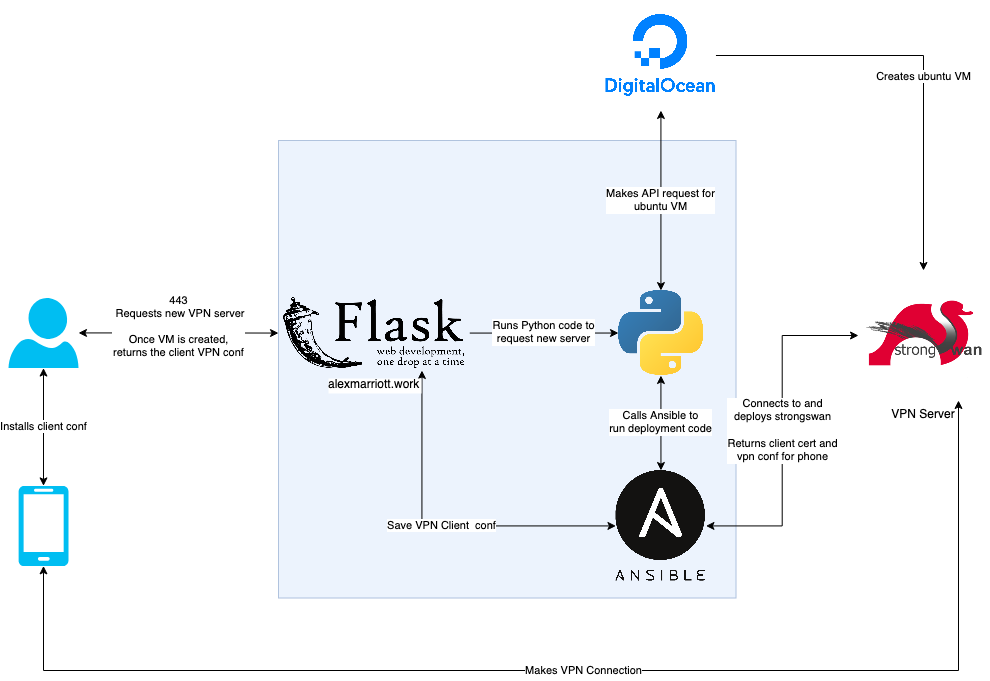

# Strongswan Ondemand

Strongswan ondemand is a python flask webserver which allows you to create a StrongSwan VPN using python and ansible.

This project uses python along with the python ansible-runner module to run the strongswan playbooks. A docker-compose
is provided for creating the flask webserver + nginx server if you want to use am SSL certificate.



## Quickstart

For Debian/Ubuntu, install the following:

```bash
# Install build dependencies on Debian or Ubuntu.
sudo apt-get install ansible python3 python3-pip docker-compose docker
```

Once you have the dependencies installed:

```bash
python3 -m venv env
source env/bin/activate
pip3 install -r webserver/requirements.txt
```

Next add a username, password and [digitalocean token] (https://docs.digitalocean.com/reference/api/create-personal-access-token/) to the entries within the "flask-variable.env", rename it to "
.env" and start up the nginx and flask containers.

```bash
vim flask-variable.env
mv flask-variable.env .env
docker-compose up -d 
```

### Using Strongswan onDemand

Log into the running flask container with the username and password from the environment file.

Once on the site you can select to "create", "refresh" and "delete" your strongswan servers.

A running server will provide you the option to "download" the VPN certificate.

Provide your vpn client with this certificate, your servers IP address and your username/password to connect.
